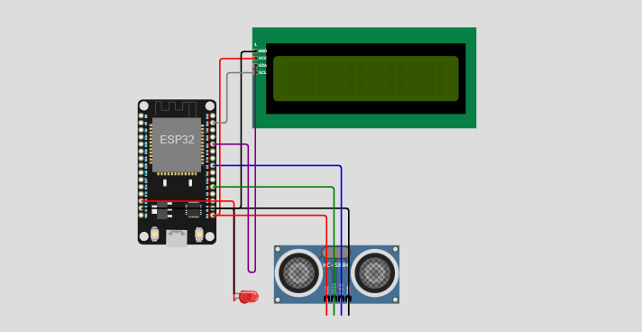

# **Leitor Automático de Água**

Este repositório implementa um sistema de **monitoramento de nível de água em um único tanque**, utilizando um ESP32, sensor ultrassônico HC-SR04, válvula, bomba e display LCD I2C. A comunicação ocorre via protocolo MQTT, e há visualização local via LCD, com possibilidade de integração futura com um dashboard (ex: Node-RED).

---

## 📷 Protótipo

> *Simulação feita no [Wokwi](https://wokwi.com/).*



---

## 🔧 Componentes Utilizados

* **Placa:** ESP32 DevKit v1 (simulado no Wokwi)
* **Sensor:** 1× HC-SR04 ultrassônico
* **Atuadores:** 1× válvula elétrica, 1× bomba de água
* **Display:** LCD 16×2 I2C (endereço `0x27`)
* **LED de status:** indicador do estado da válvula/bomba
* **Comunicação:** Wi-Fi + MQTT via `test.mosquitto.org:1883`

---

## ⚙️ Como Funciona

1. **Leitura**
   O sensor HC-SR04 mede a distância até a superfície da água.

2. **Cálculo de nível**
   A distância é convertida em altura de água e percentual de enchimento do tanque.

3. **Controle**

   * Se o nível estiver **abaixo de 10%**, a **válvula abre** e a **bomba é ativad/LED Vermelho liga**.
   * Se o nível estiver **acima de 90%**, a **válvula fecha** e a **bomba é desligada/LED Vermelho desliga**.

4. **Exibição local**
   O LCD mostra em tempo real o percentual de enchimento do tanque.

5. **MQTT**

   * Publicação em tópicos:

     * `tanque/distancia` (distância medida em cm)
     * `tanque/porcentagem` (percentual de enchimento)
   * Broker: `test.mosquitto.org` porta `1883` via TCP/IP.
   * Cliente MQTT: PubSubClient para ESP32.

---

## 📁 Estrutura de Arquivos

```plaintext
├── sketch.ino       # Código principal do projeto
├── diagram.json     # Diagrama do circuito no Wokwi
└── libraries.txt    # Bibliotecas necessárias
```

---

## 🚀 Simulação no Wokwi

1. Acesse [https://wokwi.com](https://wokwi.com)
2. Crie um novo projeto e faça upload de:

   * `sketch.ino`
   * `diagram.json`
   * `libraries.txt`
3. Clique em **Start Simulation**
4. Abra o **Serial Monitor** e observe o **LCD** na tela

---

## Interfaces e Protocolos

Este projeto utiliza comunicação via protocolo **MQTT** (Message Queuing Telemetry Transport), com os seguintes detalhes:

* **Broker:** `test.mosquitto.org`
* **Porta:** `1883`
* **Transporte:** TCP/IP
* **Client Library:** PubSubClient para ESP32

### Publicações (ESP32 → Broker)

| Tópico               | Descrição                                 |
| -------------------- | ----------------------------------------- |
| `tanque/distancia`   | Distância medida pelo sensor ultrassônico |
| `tanque/porcentagem` | Percentual de enchimento do tanque (%)    |

### Assinaturas (Broker → ESP32)

| Tópico                    | Descrição                                           |
| ------------------------- | --------------------------------------------------- |
| `tanque/config/threshold` | Limite remoto de distância para operação da válvula |

---

## 🔄 Possíveis Extensões

* Tópicos MQTT de configuração para ajuste dinâmico de limites
* Suporte a múltiplos tanques em sequência

---

## 📜 Licença

Este projeto está licenciado sob a MIT License. Veja o arquivo `LICENSE` para mais detalhes.
